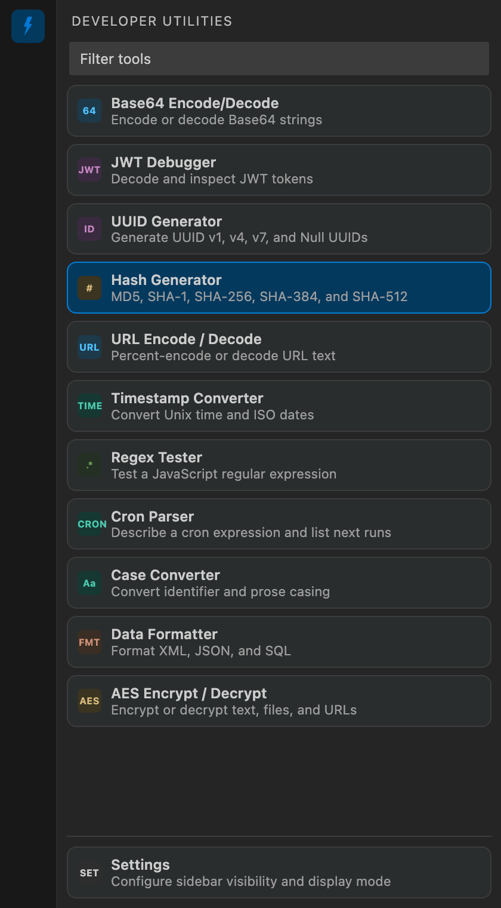
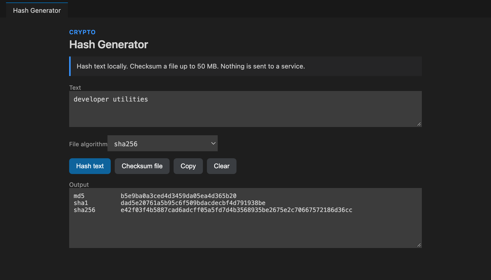
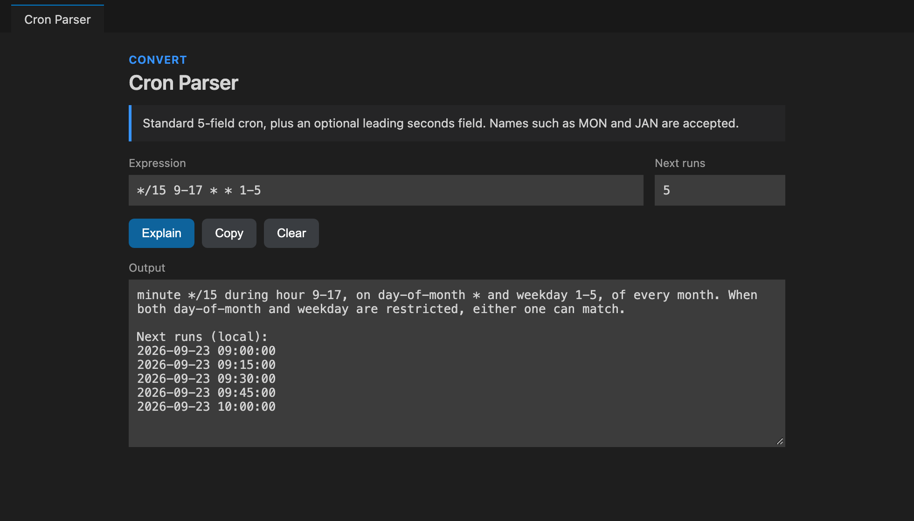

<p align="center">
  
</p>

<h1 align="center">Developer Utility Tools</h1>

<p align="center">
  Offline developer utilities for encoding, hashing, tokens, time, network, text, formatting, conversion, code generation, visualization, and certificates. Open any tool from the Activity Bar or the Command Palette. Tool input stays in the extension host.
</p>

<p align="center">
  <a href="https://marketplace.visualstudio.com/items?itemName=framedparadox.dev-x"></a>
  <a href="https://marketplace.visualstudio.com/items?itemName=framedparadox.dev-x"></a>
  <a href="https://marketplace.visualstudio.com/items?itemName=framedparadox.dev-x"></a>
  <a href="https://marketplace.visualstudio.com/items?itemName=framedparadox.dev-x"></a>
</p>

<p align="center">
  <a href="https://open-vsx.org/extension/framedparadox/dev-x"></a>
  <a href="https://open-vsx.org/extension/framedparadox/dev-x"></a>
  <a href="https://github.com/framedparadox/developer-util-vscode/blob/HEAD/LICENSE"></a>
</p>

<p align="center">
  <strong>Publisher</strong> framedparadox
  ·
  <strong>Identifier</strong> <code>framedparadox.dev-x</code>
  ·
  <strong>License</strong> MIT
  ·
  <strong>VS Code</strong> 1.105.0 or later
  ·
  <strong>Categories</strong> Other, Formatters
</p>

<p align="center">
  <a href="https://marketplace.visualstudio.com/items?itemName=framedparadox.dev-x">Install on the VS Code Marketplace</a>
  ·
  <a href="https://open-vsx.org/extension/framedparadox/dev-x">Install on Open VSX</a>
  ·
  <a href="https://github.com/framedparadox/developer-util-vscode">Source</a>
  ·
  <a href="https://github.com/framedparadox/developer-util-vscode/issues">Issues</a>
  ·
  <a href="CHANGELOG.md">Changelog</a>
</p>

<p align="center">
  
  
</p>

## Details

<details open>
<summary>Screenshots</summary>

<br />

<p align="center">
  
</p>

<p align="center">The Activity Bar view lists every tool. Filter the list, then hide tools you do not want from <strong>Developer Utilities: Configure Sidebar</strong>.</p>

<p align="center">
  
</p>

<p align="center">Hash Generator prints MD5, SHA-1, SHA-256, SHA-384, and SHA-512 for text, and can checksum a file up to 50 MB.</p>

<p align="center">
  
</p>

<p align="center">Cron Parser describes a 5-field or 6-field expression and lists the next local runs.</p>

</details>

<details>
<summary>Tools</summary>

### Data

- **Data Formatter** formats or minifies JSON and XML, and applies basic formatting to SQL. Indentation is configurable.
- **Data Converter** converts JSON, JSONC, YAML, XML, CSV, and RAML to JSON, YAML, or XML. Input is limited to 10 MB, and circular YAML aliases are rejected.
- **Data Visualizer** draws JSON, JSONC, YAML, XML, CSV, and RAML as an interactive graph. Pan, zoom, collapse nodes, switch themes, and export SVG. Graphs stop at 1,500 nodes.
- **JSONPath** queries JSON with `$.a`, `[0]`, `[*]`, slices, quoted names, and `..name`.
- **JSON to TypeScript** infers interfaces. Keys missing from some array items become optional.
- **Env / INI / Properties** parses dotenv, INI, and Java properties, and writes them back from JSON.
- **CSS Formatter** formats or minifies CSS.
- **HTML Formatter** formats, minifies, or strips tags.
- **Markdown Preview** renders headings, lists, quotes, fences, emphasis, and http(s) or mailto links. Raw HTML is escaped.
- **Gitignore Starter** inserts a short ignore list for Node, Python, Go, Java, VS Code, macOS, or Windows.
- **JSON Diff** lists added, removed, and changed values by JSONPath, or emits an RFC 6902 JSON Patch.
- **JSON / CSV** converts JSON arrays to CSV with dotted column names for nested objects, and back.
- **TOML Converter** converts TOML to JSON or YAML and JSON or YAML to TOML. Integers beyond 2^53 stay exact.
- **JSON to Code** infers Go structs, Rust serde structs, Python dataclasses, Java records, C# classes, Kotlin data classes, Swift Codable structs, Zod schemas, or JSON Schema.
- **JSON Toolkit** sorts keys recursively, flattens to dotted keys, unflattens, lists key paths, and wraps or unwraps JSON string literals.
- **Docker Run to Compose** turns a `docker run` command into a Compose service and lists any flags it did not convert.
- **cURL Converter** turns a curl command into fetch, axios, Python requests, Go net/http, HTTPie, or PowerShell code. Nothing is sent.
- **List Converter** joins lines as CSV, SQL `IN (...)`, a JSON array, Markdown, or HTML, with optional quoting, sorting, and deduplication.
- **Mock Data Generator** builds fictional rows from a `name:type` schema as JSON, NDJSON, CSV, SQL `INSERT`, or YAML.

### Encode

- **Base64 Encode/Decode** encodes text or files and rejects malformed Base64. Input is limited to 10 MB.
- **URL Encode / Decode** supports component, full-URI, and form encoding.
- **HTML Encode / Decode** escapes HTML and XML text and decodes named or numeric entities.
- **Hex / Binary Encode** converts UTF-8 text to hex, spaced hex, binary, or Base64.
- **Base32 / Base58** uses RFC 4648 Base32 and the Bitcoin Base58 alphabet.
- **Unicode Escape** escapes non-ASCII and control characters, or JSON string escapes.
- **Punycode / IDN** converts a domain, email domain, or URL hostname.
- **Gzip Compress** gzips text to Base64 and gunzips it. Expanded output is limited to 10 MB.
- **Data URI** builds or reads a text data URI.
- **Query String** parses a query to JSON and builds one from a flat JSON object.
- **Hex Dump** shows an xxd-style dump and rebuilds text from a dump or hex bytes.

### Crypto

- **AES Encrypt / Decrypt** supports AES-128, AES-192, and AES-256, the CBC, CFB, CTR, OFB, and ECB modes, and PKCS#7, ISO 9797-1, ANSI X9.23, ISO 10126, zero, and no padding. Keys can come from PBKDF2, OpenSSL-compatible EvpKDF, or explicit key and IV material. Input can be text, a file, or an HTTP/HTTPS URL you explicitly choose. URL fetches are the only network call in the extension. AES input is limited to 10 MB.
- **Hash Generator** prints MD5, SHA-1, SHA-256, SHA-384, and SHA-512, and checksums a file up to 50 MB.
- **HMAC** computes a keyed hash locally.
- **Password Generator** builds a password with `crypto.randomInt`. Ambiguous characters are omitted unless you opt in.
- **Random Token** generates hex, Base64, or Base64URL bytes.
- **Password Hasher** creates and checks a local scrypt hash. The string is not bcrypt-compatible.
- **Key Pair Generator** creates Ed25519 or RSA PEM keys in this panel only.
- **TOTP** calculates an RFC 6238 code from a Base32 secret.
- **Basic Auth Header** builds an HTTP Basic authorization header.
- **JWT Debugger** decodes the header and payload and checks numeric `exp` and `nbf` claims. It does not verify signatures.
- **JWT Signer** creates an HS256, HS384, or HS512 token locally. Signing does not mean a third party issued the token.
- **Bcrypt** creates `$2b$` hashes and verifies `$2a$`, `$2b$`, and `$2y$` hashes. Only the first 72 bytes of a password count.
- **Password Strength** estimates entropy and guessing time, and flags common passwords, repeats, sequences, keyboard patterns, and years.
- **CRC / Checksum** prints CRC-32, CRC-32C, CRC-16 (ARC, MODBUS, CCITT-FALSE, XMODEM), Adler-32, FNV-1a, MurmurHash3, and djb2.
- **Classic Ciphers** applies ROT13, ROT47, ROT5, ROT18, Caesar, Atbash, Vigenère, XOR, or reverse. These are not encryption.
- **String Obfuscator** masks secrets while keeping the first and last characters visible.
- **IBAN / Card / ISBN Validator** checks IBAN mod-97 and length, Luhn card numbers, ISBN-10/13, and EAN/UPC check digits. It does not confirm that an account or card exists.

### Identifiers

- **UUID Generator** generates UUID v1, v4, v7, and the nil UUID, including bulk lists up to 1,000 values. UUID v7 values stay ordered within the same millisecond.
- **ULID Generator** generates sortable Crockford Base32 ULIDs.
- **Nano ID Generator** generates URL-safe IDs with rejection sampling.
- **Snowflake ID** generates and decodes Twitter-style IDs.

### Convert

- **Timestamp Converter** accepts now, Unix seconds, Unix milliseconds, or a date string.
- **Number Base** converts integers between bases 2 and 36.
- **Color Converter** converts hex, `rgb()`, `hsl()`, and common CSS color names.
- **Contrast Checker** reports the WCAG 2 contrast ratio.
- **Case Converter** shows lower, upper, title, sentence, camel, Pascal, snake, screaming snake, and kebab forms.
- **Slug Generator** builds an ASCII URL slug.
- **Cron Parser** explains standard cron, including an optional seconds field and names such as `MON` and `JAN`.
- **Chmod Calculator** converts octal, symbolic, and `u=rwx,g=rx,o=r` modes, including setuid, setgid, and sticky bits.
- **IPv4 Subnet** calculates the mask, network, broadcast, and usable hosts. A bare address also converts to decimal and hex.
- **IPv6 ULA** generates an RFC 4193-style local prefix.
- **MAC Address** reformats 12 hex digits and generates random locally administered addresses, optionally with a vendor prefix.
- **SemVer Calculator** compares versions, bumps major, minor, or patch, and tests `=`, `>`, `>=`, `<`, `<=`, `^`, `~`, `x`, and `||`.
- **CSS Units** converts px and rem and simplifies an aspect ratio.
- **Byte Units** shows decimal and binary byte units.
- **Roman Numerals** converts integers from 1 to 3999.
- **Date Calculator** measures the difference between two dates, including business days, or adds and subtracts durations.
- **Time Zone Converter** shows a moment, or a wall-clock time in a source zone, across IANA time zones.
- **IPv4 Range / Converter** converts an address to decimal, hex, binary, IPv6-mapped, and reverse DNS forms, turns a range into CIDR blocks, and expands small CIDRs.

### Math

- **Math Evaluator** evaluates expressions line by line with variables, functions, bitwise operators, and hex or binary literals. It parses the input; it does not execute code.
- **Percentage Calculator** shows X% of Y, percent change and difference, increases, decreases, and ratios.
- **Unit Converter** converts length, mass, temperature, time, speed, area, volume, data, pressure, energy, and angle units.
- **ETA Calculator** estimates the finish time of a job from the work done and the time elapsed.

### Text

- **Format Text** escapes and unescapes JSON-style control sequences, quotes, slashes, and Unicode escapes.
- **Regex Tester** runs a JavaScript regular expression. Patterns are limited to 200 characters and text to 20,000 characters.
- **Glob Tester** matches paths against `*`, `?`, and `**`.
- **Text Diff** shows a line diff or the lines only on the left, only on the right, or in both.
- **Text Statistics** counts characters, UTF-8 bytes, words, lines, sentences, and reading time.
- **Line Tools** sorts, dedupes, reverses, trims, numbers, prefixes, suffixes, or shuffles lines.
- **Lorem Ipsum** generates words, sentences, or paragraphs.
- **ASCII / Code Points** searches the ASCII table or lists code points.
- **NATO Phonetic** spells letters and digits.
- **String Escape** escapes and unescapes text for JSON, JavaScript, Java, C#, C, Python, Go, YAML, regex, POSIX shell, PowerShell, cmd, SQL, CSV, XML, and Markdown.
- **Numeronym Generator** turns words into numeronyms such as i18n and k8s.
- **Morse Code** encodes and decodes International Morse code.
- **Cheatsheets** is a searchable quick reference for Git, regex, Docker, kubectl, Vim, and HTTP.

### Web

- **URL Parser** splits a URL. A missing scheme is treated as `https`. The password is not printed.
- **User-Agent Parser** summarizes browser, system, device class, and bot hints.
- **MIME Types** looks up common extensions and media types.
- **HTTP Status** looks up common status codes.
- **QR Code** builds an SVG for text or a Wi-Fi payload.
- **Random Port** picks a port number. It does not check whether the port is free.
- **Key Codes** shows `key`, `code`, `keyCode`, location, and modifiers for a key you press.
- **Device Info** shows platform, CPU, memory, Node, and VS Code version. User name and home directory are omitted.
- **CORS Headers** drafts `Access-Control-Allow-*` lines.
- **Meta Tag Generator** writes SEO, Open Graph, and Twitter card tags with escaped values.
- **Safe Link Decoder** unwraps Microsoft Defender Safe Links, Proofpoint URL Defense v1 to v3, and Google, Facebook, and LinkedIn redirects without opening them.
- **Email Normalizer** lowercases addresses, strips `+tags`, removes Gmail dots, and maps alias domains so duplicates are easy to find.
- **SVG Placeholder** builds a placeholder image as SVG, a data URI, or a CSS background.
- **CSP Analyzer** lists Content-Security-Policy directives, flags common weaknesses, and offers starter policies.

### Certificates

- **Certificate Tools** inspects PEM X.509 date windows. It does not decide trust, hostname, or revocation. It can decode a PEM bundle and generate quoted POSIX `keytool` and OpenSSL commands without collecting passwords or private keys.
- **Certificate Expiry Checker** scans a selected folder for `.crt`, `.cer`, `.cert`, `.pem`, `.der`, `.ca-bundle`, `.ca`, and `.bundle` files.

</details>

<details>
<summary>Privacy</summary>

Tool input is processed in the extension host. The extension does not send analytics or tool content to a service. The only network operation is the explicit HTTP/HTTPS fetch in the AES tool's URL input mode. Passwords, keys, tokens, and TOTP secrets are shown only in the panel that created them.

</details>

<details>
<summary>Sidebar</summary>

The Developer Utilities Activity Bar view is configurable:

- Filter the tool list.
- Choose which tools are visible.
- Select compact, simple, comfortable, or icon-only layouts.
- Reset visibility and layout preferences to their defaults.

New tools are visible by default. Certificate Tools, Certificate Expiry Checker, Data Visualizer, and Data Converter stay hidden until you enable them from **Developer Utilities: Configure Sidebar**.

</details>

<details>
<summary>Requirements</summary>

- VS Code 1.105.0 or later
- No extra runtime. Gzip, hashes, keys, and QR codes use the editor's Node runtime. QR codes, bcrypt, and TOML use the bundled `qrcode`, `bcryptjs`, and `smol-toml` libraries.

</details>

<details>
<summary>Development</summary>

```bash
npm install
npm run compile-tests
npm run lint
npm test
npm run package
npm run package:vsix
```

`npm run package:vsix` runs the production build through the extension's `vscode:prepublish` hook before creating the VSIX.

</details>

<details>
<summary>Support</summary>

Report defects and feature requests in the [GitHub issue tracker](https://github.com/framedparadox/developer-util-vscode/issues).

See [CHANGELOG.md](CHANGELOG.md) for release notes.

</details>
